# 🏗️ Diagramas de Arquitetura - FCG PAGAMENTOS

## 📋 Visão Geral

Este documento contém os diagramas de arquitetura do microsserviço de pagamentos em diferentes níveis de abstração, desde a visão geral do sistema até os detalhes de implementação.

## 🎯 Níveis de Arquitetura

1. **Visão Geral do Sistema** - Contexto e integração com outros serviços
2. **Arquitetura de Microsserviços** - Estrutura interna e comunicação
3. **Arquitetura de Dados** - Modelos de dados e persistência
4. **Arquitetura de Segurança** - Autenticação, autorização e proteção
5. **Arquitetura de Deploy** - Infraestrutura e pipelines

## 🌐 1. Visão Geral do Sistema

### Diagrama de Contexto
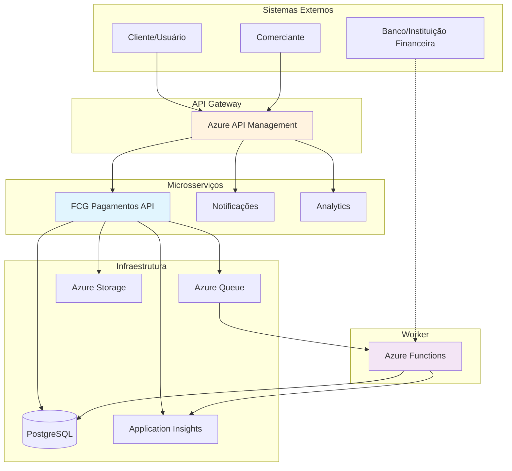

### Fluxo de Comunicação
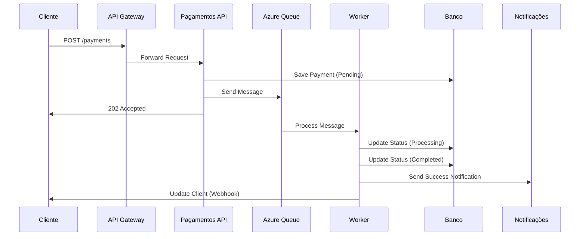

## 🏢 2. Arquitetura de Microsserviços

### Arquitetura Hexagonal (Clean Architecture)
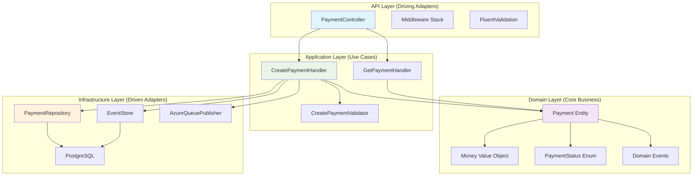

### Estrutura de Camadas
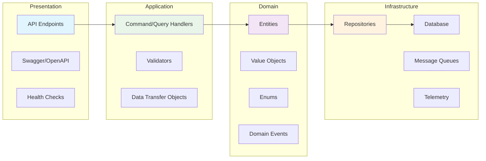

## 💾 3. Arquitetura de Dados

### Modelo de Dados
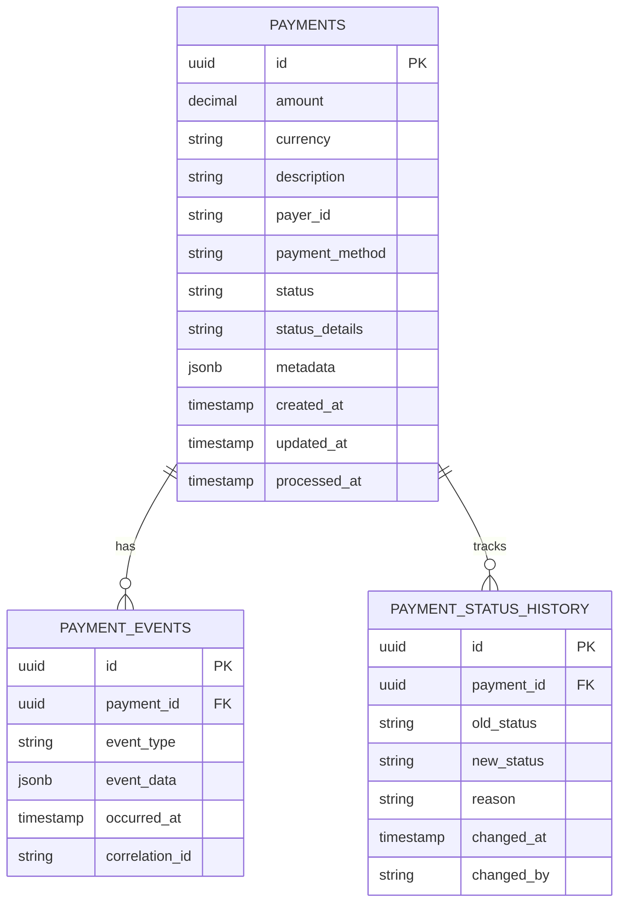

### Fluxo de Eventos (Event Sourcing)
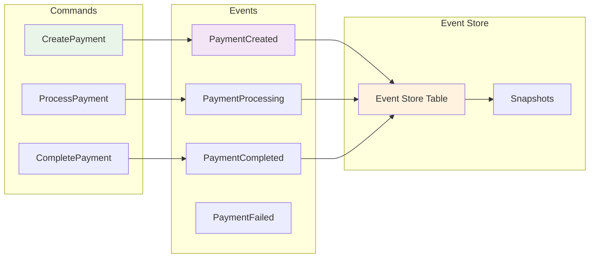

### Estratégia de Persistência
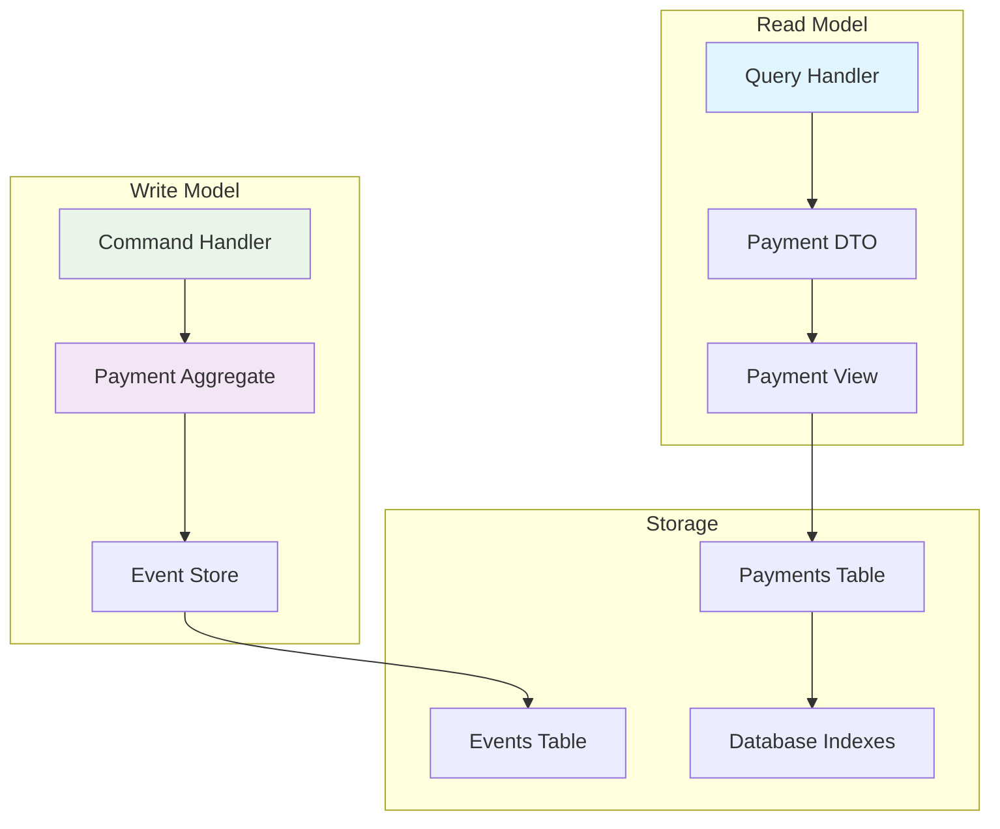

## 🔒 4. Arquitetura de Segurança

### Camadas de Segurança
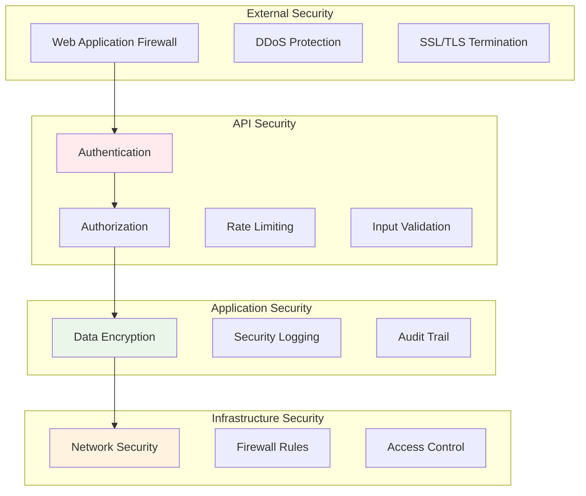

### Fluxo de Autenticação
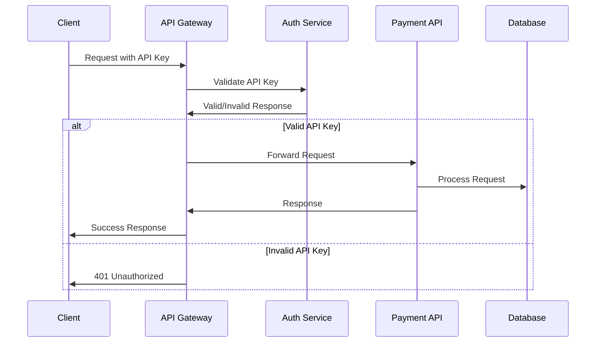

## 🚀 5. Arquitetura de Deploy

### Infraestrutura no Azure
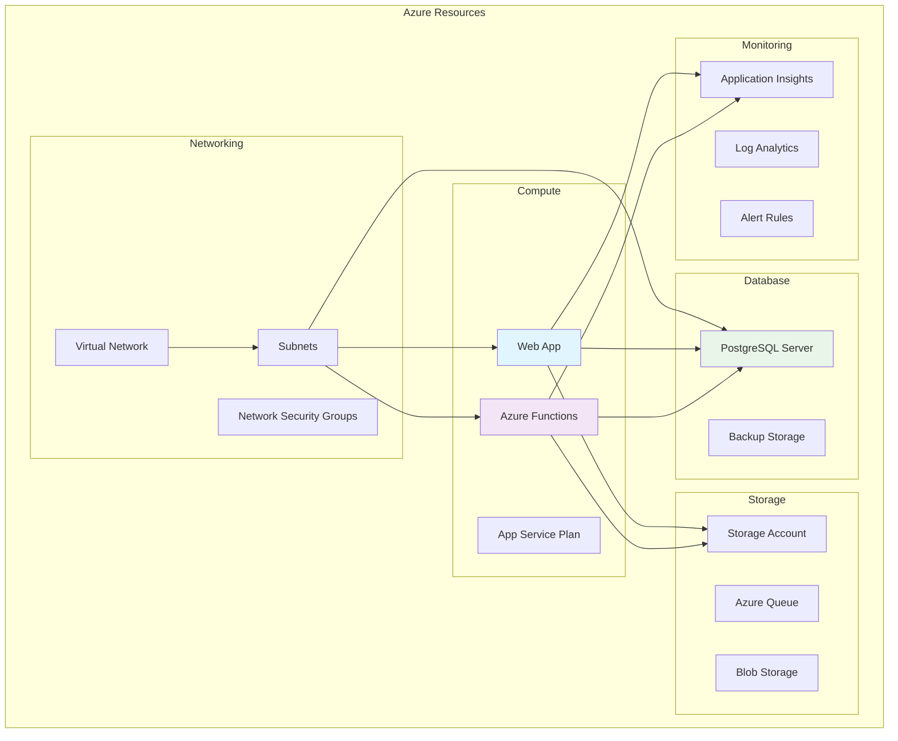

### Pipeline de CI/CD
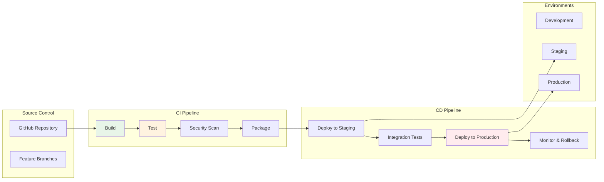

## 📊 6. Arquitetura de Monitoramento

### Observabilidade
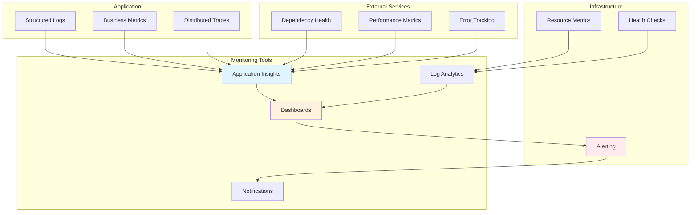

## 🔄 7. Padrões de Arquitetura

### Padrões Utilizados
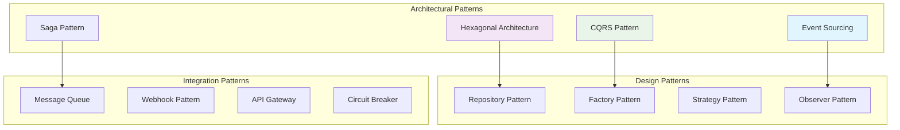

## 📈 8. Escalabilidade e Performance

### Estratégias de Escalabilidade
```mermaid
graph TB
    subgraph "Horizontal Scaling"
        LOAD_BALANCER[Load Balancer]
        MULTIPLE_INSTANCES[Multiple API Instances]
        AUTO_SCALING[Auto Scaling Rules]
    end
    
    subgraph "Database Scaling"
        READ_REPLICAS[Read Replicas]
        SHARDING[Database Sharding]
        CACHING[Redis Cache]
    end
    
    subgraph "Queue Scaling"
        MULTIPLE_QUEUES[Multiple Queues]
        MULTIPLE_WORKERS[Multiple Workers]
        PARTITIONING[Queue Partitioning]
    end
    
    subgraph "Performance"
        CDN[Content Delivery Network]
        COMPRESSION[Response Compression]
        OPTIMIZATION[Query Optimization]
    end
    
    LOAD_BALANCER --> MULTIPLE_INSTANCES
    MULTIPLE_INSTANCES --> AUTO_SCALING
    
    READ_REPLICAS --> CACHING
    MULTIPLE_QUEUES --> MULTIPLE_WORKERS
    
    CDN --> COMPRESSION
    COMPRESSION --> OPTIMIZATION
    
    style LOAD_BALANCER fill:#e1f5fe
    style READ_REPLICAS fill:#e8f5e8
    style MULTIPLE_QUEUES fill:#f3e5f5
```

## 🎯 9. Decisões de Arquitetura

### Trade-offs e Decisões

| Aspecto | Decisão | Justificativa | Alternativas Consideradas |
|---------|---------|---------------|---------------------------|
| **Banco de Dados** | PostgreSQL | ACID, JSON support, Open source | SQL Server, MySQL |
| **Mensageria** | Azure Queue | Simplicidade, Integração Azure | RabbitMQ, Kafka |
| **Arquitetura** | Hexagonal | Testabilidade, Flexibilidade | MVC, Clean Architecture |
| **Event Sourcing** | Implementado | Audit trail, Replay capability | CRUD tradicional |
| **API Gateway** | Azure APIM | Gerenciamento centralizado | Kong, AWS API Gateway |
| **Monitoramento** | Application Insights | Integração Azure, AI/ML | Prometheus, Grafana |

### Riscos e Mitigações

| Risco | Probabilidade | Impacto | Mitigação |
|-------|---------------|---------|-----------|
| **Perda de dados** | Baixa | Alto | Backup automático, Event sourcing |
| **Performance** | Média | Média | Cache, Read replicas, Auto-scaling |
| **Segurança** | Média | Alto | WAF, Rate limiting, Input validation |
| **Disponibilidade** | Baixa | Alto | Multi-region, Health checks, Circuit breaker |

## 📚 10. Referências e Recursos

### Documentação
- [Azure Architecture Center](https://docs.microsoft.com/en-us/azure/architecture/)
- [Clean Architecture](https://blog.cleancoder.com/uncle-bob/2012/08/13/the-clean-architecture.html)
- [Event Sourcing](https://martinfowler.com/eaaDev/EventSourcing.html)
- [CQRS Pattern](https://docs.microsoft.com/en-us/azure/architecture/patterns/cqrs)

### Ferramentas
- [Draw.io](https://draw.io/) - Criação de diagramas
- [Mermaid](https://mermaid-js.github.io/mermaid/) - Diagramas em Markdown
- [Azure Architecture Icons](https://docs.microsoft.com/en-us/azure/architecture/icons/) - Ícones oficiais

---

**Versão dos Diagramas**: 1.0.0  
**Mantido por**: Equipe de Arquitetura FCG
