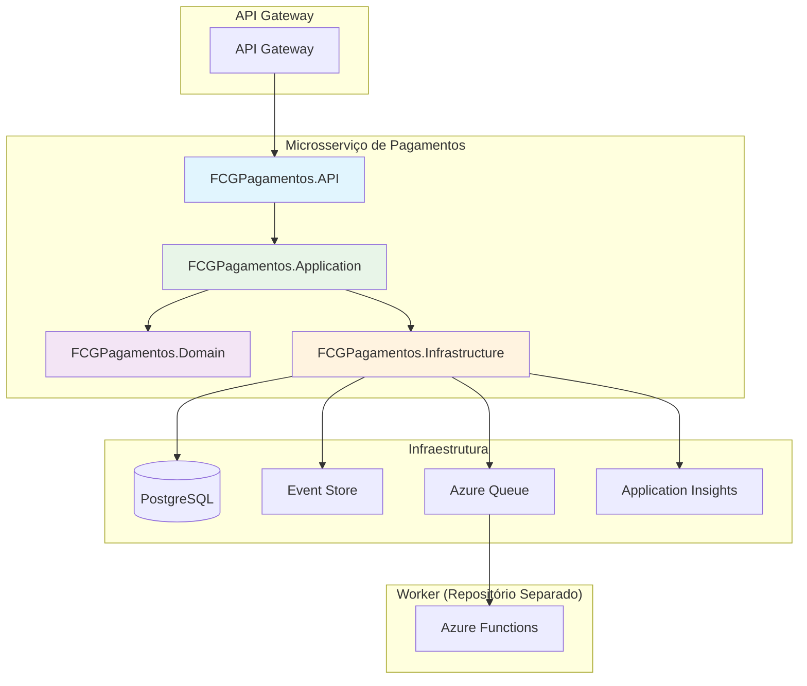

# FCG PAGAMENTOS - Microsserviço de Pagamentos

## 📋 Visão Geral

Este repositório contém a implementação de um microsserviço de pagamentos com arquitetura robusta e escalável, seguindo os princípios da **Arquitetura Hexagonal** e **Event Sourcing**. O sistema é responsável por processar pagamentos e expor o status das transações de forma assíncrona.

## 🏗️ Arquitetura

### Diagrama de Arquitetura



### Estrutura do Projeto

```
├── /src
│   ├── FCGPagamentos.API              # Camada de apresentação (Controllers/Endpoints)
│   ├── FCGPagamentos.Application      # Casos de uso e regras de negócio
│   ├── FCGPagamentos.Domain          # Entidades e lógica de domínio
│   └── FCGPagamentos.Infrastructure  # Implementações técnicas (DB, Queue, etc.)
├── /tests
│   └── FCGPagamentos.API.Tests       # Testes unitários e de integração
└── /.github
    └── /workflows                     # CI/CD Pipeline
```

## 🚀 Funcionalidades

### ✅ Implementado
- ✅ Criação de pagamentos (POST /payments)
- ✅ Consulta de pagamentos (GET /payments/{id})
- ✅ Validação de dados com FluentValidation
- ✅ Persistência em PostgreSQL
- ✅ Publicação em Azure Queue para processamento assíncrono
- ✅ Health checks completos (Database + Azure Queue)
- ✅ Swagger/OpenAPI
- ✅ Application Insights para telemetria
- ✅ **Event Sourcing completo** com eventos de domínio
- ✅ **Observabilidade completa** com OpenTelemetry + Prometheus
- ✅ **Correlation ID** para rastreamento distribuído
- ✅ **Métricas de negócio** específicas do domínio
- ✅ **API Gateway** configurado (Azure API Management)

### 🔄 Processamento Assíncrono
1. **Criação**: API recebe requisição e retorna 202 (Accepted)
2. **Persistência**: Dados são salvos no banco com status "Pending"
3. **Enfileiramento**: Mensagem é enviada para Azure Queue
4. **Processamento**: Worker (Azure Functions) processa a mensagem
5. **Atualização**: Status é atualizado no banco

## 📚 Documentação da API

### Endpoints

#### POST /payments
Cria um novo pagamento.

**Request Body:**
```json
{
  "amount": 100.50,
  "currency": "BRL",
  "description": "Pagamento de serviço",
  "userId": "123e4567-e89b-12d3-a456-426614174000",
  "gameId": "987fcdeb-51a2-43d1-9f12-345678901234",
  "paymentMethod": "PIX"
}
```

**Response:**
- **201 Created**: Pagamento criado com sucesso
- **202 Accepted**: Pagamento aceito para processamento
- **400 Bad Request**: Dados inválidos
- **422 Unprocessable Entity**: Erro de validação

#### GET /payments/{id}
Consulta um pagamento pelo ID.

**Response:**
- **200 OK**: Pagamento encontrado
- **404 Not Found**: Pagamento não encontrado

#### GET /health
Health check básico do serviço.

**Response:**
- **200 OK**: Serviço saudável

#### GET /health/detailed
Health check detalhado com status de todas as dependências.

**Response:**
- **200 OK**: Status detalhado de Database, Azure Queue e outras dependências

#### GET /metrics
Métricas Prometheus para monitoramento.

**Response:**
- **200 OK**: Métricas no formato Prometheus

### Modelos de Dados

#### PaymentDto
```json
{
  "id": "uuid",
  "amount": 100.50,
  "currency": "BRL",
  "status": "Pending",
  "createdAt": "2024-01-01T10:00:00Z",
  "updatedAt": "2024-01-01T10:00:00Z"
}
```

#### PaymentStatus
- `Pending`: Aguardando processamento
- `Processing`: Em processamento
- `Completed`: Concluído com sucesso
- `Failed`: Falhou
- `Cancelled`: Cancelado

## 🛠️ Tecnologias Utilizadas

- **.NET 8.0**: Framework principal
- **Entity Framework Core**: ORM para PostgreSQL
- **FluentValidation**: Validação de dados
- **Azure Storage Queues**: Mensageria assíncrona
- **Application Insights**: Telemetria e monitoramento
- **Swagger/OpenAPI**: Documentação da API
- **PostgreSQL**: Banco de dados principal
- **OpenTelemetry**: Observabilidade e rastreamento distribuído
- **Prometheus**: Métricas e monitoramento
- **Event Sourcing**: Registro de eventos de domínio
- **Correlation ID**: Rastreamento de requisições

## 🚀 Deploy e Configuração

### Pré-requisitos
- .NET 8.0 SDK
- PostgreSQL 12+
- Azure Storage Account
- Azure Application Insights

### Configuração Local

1. **Clone o repositório**
```bash
git clone https://github.com/seu-usuario/FCG_PAGAMENTOS.git
cd FCG_PAGAMENTOS
```

2. **Configure as variáveis de ambiente**
```bash
# src/FCGPagamentos.API/appsettings.Development.json
{
  "ConnectionStrings": {
    "DefaultConnection": "Host=localhost;Database=fcg_pagamentos;Username=postgres;Password=sua_senha"
  },
  "AzureStorage": {
    "ConnectionString": "DefaultEndpointsProtocol=https;AccountName=sua_conta;AccountKey=sua_chave;EndpointSuffix=core.windows.net"
  },
  "ApplicationInsights": {
    "ConnectionString": "sua_connection_string"
  }
}
```

3. **Execute as migrações**
```bash
cd src/FCGPagamentos.API
dotnet ef database update
```

4. **Execute o projeto**
```bash
dotnet run
```

### Deploy em Produção

#### Azure App Service
1. **Configure o Azure App Service**
```bash
az webapp create --name fcg-pagamentos-api --resource-group seu-rg --plan seu-app-plan --runtime "DOTNETCORE:8.0"
```

2. **Configure as variáveis de ambiente**
```bash
az webapp config appsettings set --name fcg-pagamentos-api --resource-group seu-rg --settings \
  "ConnectionStrings__DefaultConnection"="sua_connection_string" \
  "AzureStorage__ConnectionString"="sua_storage_connection" \
  "ApplicationInsights__ConnectionString"="sua_ai_connection"
```

3. **Deploy via GitHub Actions**
```bash
git push origin main
```

#### Azure Functions (Worker)
O worker de processamento está em repositório separado e deve ser configurado para:
- Escutar a Azure Queue
- Processar mensagens de pagamento
- Atualizar status no banco
- Implementar retry logic

### Configuração do API Gateway

#### Azure API Management
1. **Crie uma API no APIM**
2. **Configure as rotas**:
   - `/payments` → FCGPagamentos.API
   - `/health` → FCGPagamentos.API
3. **Configure rate limiting** (opcional)
4. **Configure autenticação** (opcional)

## 🧪 Testes

### Executar Testes
```bash
# Todos os testes
dotnet test

# Testes específicos
dotnet test --filter "Category=Unit"
dotnet test --filter "Category=Integration"
```

### Cobertura de Código
```bash
dotnet test --collect:"XPlat Code Coverage"
```

## 📊 Monitoramento

### Application Insights
- **Métricas**: Request rate, response time, error rate
- **Logs**: Structured logging com correlation ID
- **Traces**: Distributed tracing entre serviços
- **Alertas**: Configuração automática de alertas

### Health Checks
- **Database**: Verificação de conectividade
- **Azure Queue**: Verificação de conectividade
- **Dependencies**: Status de serviços externos

## 🔒 Segurança

### Autenticação/Autorização
- **API Key**: Para comunicação entre microsserviços
- **JWT**: Para autenticação de usuários (opcional)
- **Rate Limiting**: Proteção contra abuso (opcional)

### Validação
- **Input Validation**: Validação de dados de entrada
- **SQL Injection**: Proteção via Entity Framework
- **XSS**: Proteção via ASP.NET Core

## 📈 Escalabilidade

### Estratégias
- **Horizontal Scaling**: Múltiplas instâncias da API
- **Database Scaling**: Read replicas para consultas
- **Queue Scaling**: Múltiplas workers processando filas
- **Caching**: Redis para dados frequentemente acessados

## 🚨 Troubleshooting

### Problemas Comuns

#### Erro de Conexão com Banco
```bash
# Verificar se o PostgreSQL está rodando
# Verificar connection string
# Verificar se as migrações foram executadas
```

#### Erro de Azure Queue
```bash
# Verificar connection string do Storage
# Verificar se a queue existe
# Verificar permissões
```

#### Performance Lenta
```bash
# Verificar índices do banco
# Verificar Application Insights para bottlenecks
# Verificar configuração de connection pooling
```

## 📞 Suporte

- **Issues**: [GitHub Issues](https://github.com/seu-usuario/FCG_PAGAMENTOS/issues)
- **Documentação**: Este README
- **Arquitetura**: Diagrama acima
- **API**: Swagger em `/swagger` quando rodando

## 📄 Licença

Este projeto está sob a licença MIT. Veja o arquivo [LICENSE](LICENSE) para mais detalhes.

---

**Versão**: 1.0.0  
**Status**: Em desenvolvimento